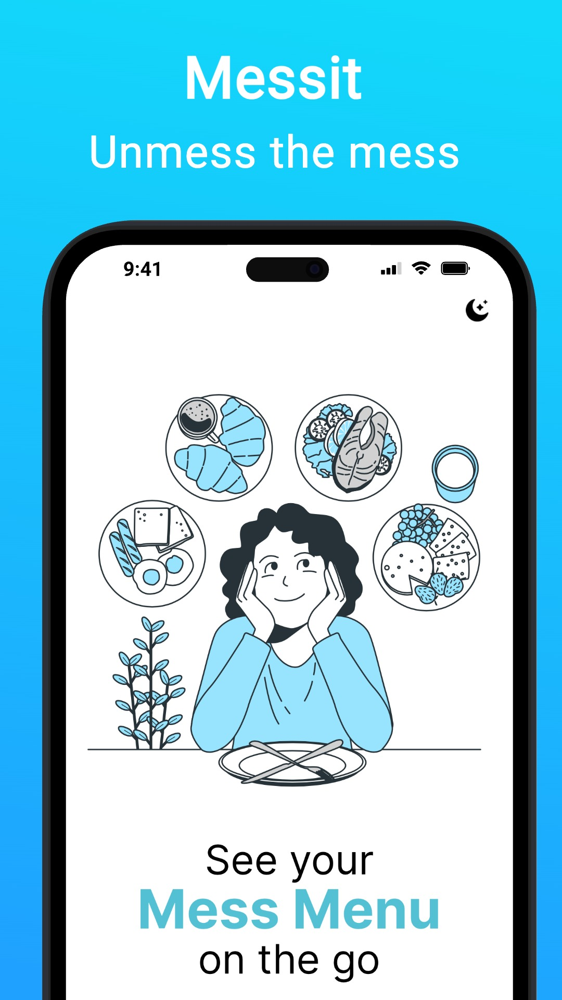
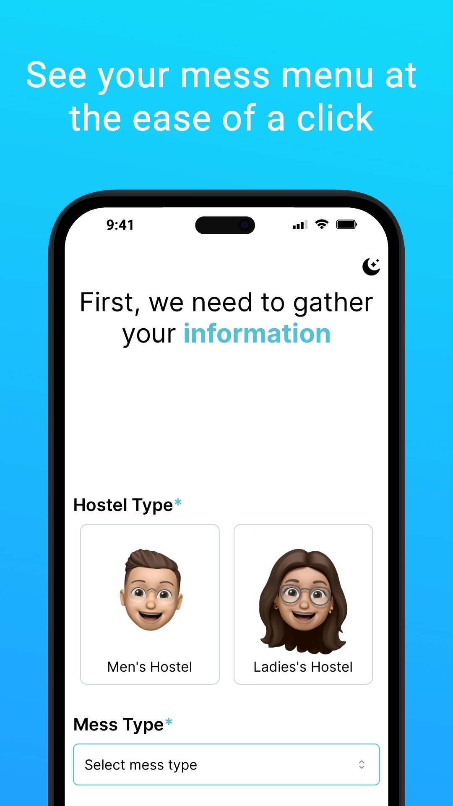
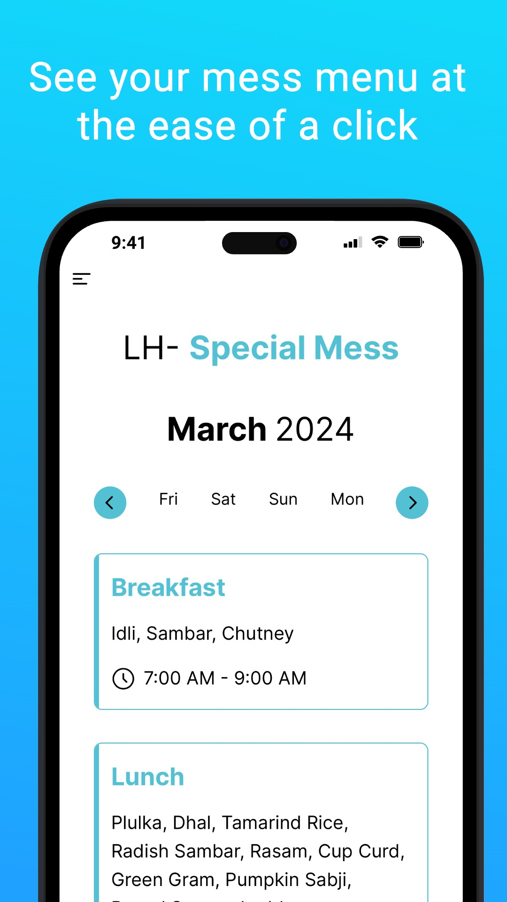
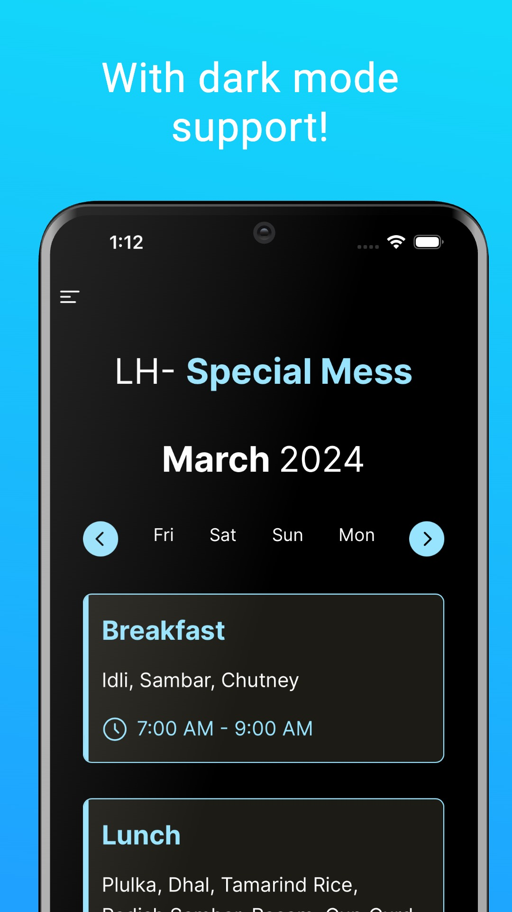

<a id="readme-top"></a>


<!-- Club Logo -->
<br />
<div align="center">
  <a href="https://github.com/vinnovateit/messit-web">
    <picture>
      <source media="(prefers-color-scheme: dark)" srcset="https://raw.githubusercontent.com/vinnovateit/.github/main/assets/whiteLogoViit.svg">
      
    </picture>
  </a>

<h3 align="center">Messit web</h3>

  <p align="center">
    See your mess menu on the go
    <br />
    <br />
    <a href="https://messit.vinnovateit.com/">Check it out!</a>
    &middot;
    <a href="https://github.com/vinnovateit/messit-web/issues/new?labels=bug&template=bug_report.md">Report Bug</a>
    &middot;
    <a href="https://github.com/vinnovateit/messit-web/issues/new?labels=enhancement&template=feature_request.md">Request Feature</a>
  </p>
</div>


<!-- TABLE OF CONTENTS -->
<!-- Use if things get too long -->
<!-- <details>
  <summary>Table of Contents</summary>
  <ol>
    <li>
      <a href="#about-the-project">About The Project</a>
      <ul>
        <li><a href="#built-with">Built With</a></li>
      </ul>
    </li>
    <li><a href="#roadmap">Roadmap</a></li>
    <li>
      <a href="#getting-started">Getting Started</a>
      <ul>
        <li><a href="#prerequisites">Prerequisites</a></li>
        <li><a href="#installation">Installation</a></li>
      </ul>
    </li>
    <li><a href="#usage">Usage</a></li>
    <li><a href="#acknowledgments">Acknowledgments</a></li>
  </ol>
</details> -->


<!-- ABOUT THE PROJECT -->
## About

<!-- Put the PROJECT LOGO here -->
<picture>
  <source media="(prefers-color-scheme: dark)" srcset="public/icons/icon-192.png">
  
</picture>

Look up your hostel menu from anywhere. Now as a PWA for easier access on your favourite devices.

<details>
  <summary><b>Screenshots</b></summary>
  
  | Landing | Menu selection |
  | :--------------: | :--------: |
  |  |  |
  | **Menu page** | **Dark mode** |
  |  |  |

</details>

### Built With

[![PWA][PWA]][PWA-url]
[![Next][Next.js]][Next-url]
[![React][React.js]][React-url]
[![shadcn/ui][shadcn-ui]][shadcn-url]
[![TailwindCSS][TailwindCSS]][Tailwind-url]
[![Pages][Pages]][Pages-url]
<!-- ROADMAP -->
## Roadmap

- [x] Mess Selection
- [x] Menu caching
- [x] PWA support
    - [x] Icons
    - [x] Splash
- [x] ~Recruits banner~

See the [open issues](https://github.com/vinnovateit/messit-web/issues) for a full list of proposed features (and known issues).


<!-- GETTING STARTED -->
## Getting Started
The production environment is currently deployed on Cloudflare Pages. To set up the development environment, follow the steps below.
### Prerequisites
* nodejs (tested on v22)
* npm

### Installation

1. Clone the repo
   ```sh
   git clone https://github.com/vinnovateit/messit-web.git
   ```
2. Install NPM packages
   ```sh
   npm install
   ```
3. Run dev env
   ```sh
   npm run dev
   ```
4. For production, 
   ```sh
   npm run build
   # then serve the output dir with program of your choice, eg 
   npx serve out
   ```


### Top contributors:

<a href="https://github.com/vinnovateit/messit-web/graphs/contributors">
  
</a>


<!-- ACKNOWLEDGMENTS -->
## Acknowledgments

* [serwist](https://serwist.pages.dev/)
* Countless blogs on PWA quirks across different platforms


<p align="center">
	Made with :heart: by <a href="https://vinnovateit.com">VinnovateIT</a>
</p>

<!-- MARKDOWN LINKS & IMAGES -->
<!-- https://www.markdownguide.org/basic-syntax/#reference-style-links -->
[Next.js]: https://img.shields.io/badge/next.js-000000?&logo=nextdotjs&logoColor=white
[Next-url]: https://nextjs.org/
[React.js]: https://img.shields.io/badge/React-20232A?&logo=react&logoColor=61DAFB
[React-url]: https://reactjs.org/
[shadcn-ui]: https://img.shields.io/badge/shadcn%2Fui-000?logo=shadcnui&logoColor=fff
[shadcn-url]: https://ui.shadcn.com/
[TailwindCSS]: https://img.shields.io/badge/Tailwind%20CSS-%2338B2AC.svg?logo=tailwind-css&logoColor=white
[Tailwind-url]: https://tailwindcss.com/
[PWA]: https://img.shields.io/badge/optimized-5A0FC8?logo=pwa&logoSize=auto
[PWA-url]: https://web.dev/explore/progressive-web-apps
[Pages]: https://img.shields.io/badge/pages-F38020?logo=cloudflarepages&logoColor=white
[Pages-url]: https://pages.cloudflare.com/
